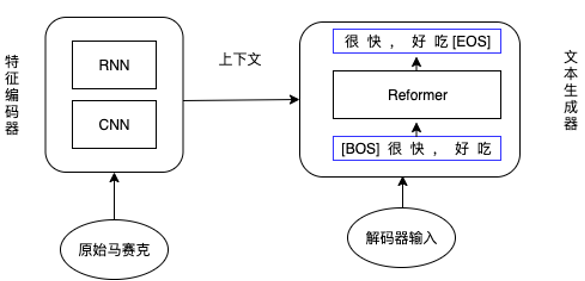
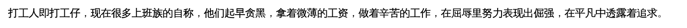

# TextDemosaicing
Chinese Text Demosaicing based on Seq2Seq Model. 

中文文本马赛克去除实验，基于Seq2Seq文本生成方案，使用CRNN提取上下文特征，使用Reformer的Decoder部分进行文本生成。

## Env

- deep learning: pytorch 1.6、tensorboardX、reformer_pytorch
- image process: opencv-python、skimage、pygame
- machine learning tool: numpy、pandas、scikit-learn、gensim
- utils: tqdm
- pretrained word2vec: sgns.merge.char [google](https://drive.google.com/file/d/1aVAK0Z2E5DkdIH6-JHbiWSL5dbAcz6c3/view) [baidu](https://pan.baidu.com/s/1DjIGENlhRbsVyHW-caRePg)

## Model



- Max Sequence Length: 64
- Word Embedding Size: 300
- Beam Search Size: 16
- Mosaice Size: <=5 * 5 for well working

    
    ==>
    

## Overview

- Prepare Dataset: input/text_set
- Make Dataset: `cd src; python3 make_dataset.py`
- Train/Test: `cd src; python3 train.py`


## Model Detail

**CRNN** for feature encoding:
``` Python
class CRNN(nn.Module):
    def __init__(self, in_channels=1, out_channels=300):
        super(CRNN, self).__init__()
        self.in_channels = in_channels
        hidden_size = 150

        self.cnn_struct = ((32, ), (64, ), (128, 128), (256, 256), (256, )) 
        self.cnn_paras = ((3, 1, 1), (3, 1, 1),
                          (3, 1, 1), (3, 1, 1), (2, 1, 0)) 

        self.pool_struct = ((2, 2), (2, 2), (2, 1), (2, 1), None) 

        self.batchnorm = (False, False, False, True, False) 
        self.cnn = self._get_cnn_layers()
        self.rnn1 = nn.LSTM(self.cnn_struct[-1][-1], hidden_size, bidirectional=True)
        self.rnn2 = nn.LSTM(hidden_size*2, hidden_size, bidirectional=True)
        self.dropout = nn.Dropout(0.2)
        self._initialize_weights()
    
    def forward(self, x):          
        x = self.cnn(x)             
        x = x.squeeze(2)            
        x = x.permute(2, 0, 1)     
        x = self.rnn1(x)[0]         
        x = self.dropout(x)
        x = self.rnn2(x)[0]        
        x = x.transpose(0, 1)
        return x

    def _get_cnn_layers(self):
        cnn_layers = []
        in_channels = self.in_channels
        for i in range(len(self.cnn_struct)):
            for out_channels in self.cnn_struct[i]:
                cnn_layers.append(
                    nn.Conv2d(in_channels, out_channels, *(self.cnn_paras[i])))
                if self.batchnorm[i]:
                    cnn_layers.append(nn.BatchNorm2d(out_channels))
                cnn_layers.append(nn.ReLU(inplace=True))
                in_channels = out_channels
            if (self.pool_struct[i]):
                cnn_layers.append(nn.MaxPool2d(self.pool_struct[i]))
        return nn.Sequential(*cnn_layers)
    
    def _initialize_weights(self):
        for m in self.modules():
            if isinstance(m, nn.Conv2d):
                n = m.kernel_size[0] * m.kernel_size[1] * m.out_channels
                m.weight.data.normal_(0, np.sqrt(2. / n))
                if m.bias is not None:
                    m.bias.data.zero_()
            elif isinstance(m, nn.BatchNorm2d):
                m.weight.data.fill_(1)
                m.bias.data.zero_()

```

**Transformer** for Sequence Decoder:

``` Python

class TransformerModel(nn.Module):
    def __init__(self, model_args={}):
        super().__init__()
        self.model_dim = model_args.get('model_dim', 300)
        self.max_encoder_len = model_args.get('max_encoder_len', 1604)
        self.max_decoder_len = model_args.get('max_decoder_len', 66)
        self.vocab_size = model_args.get('vocab_size', 4000)

        self.encoder = CRNN()

        self.decoder = ReformerLM(
            num_tokens = self.vocab_size,
            dim = self.model_dim,
            depth = 2,
            heads = 1,
            bucket_size = 233,
            ff_dropout=0.2,
            causal = True,
            max_seq_len = self.max_decoder_len
        )
        if model_args.get('decoder_embedding', None) is not None:
            self.decoder.token_emb = nn.Embedding.from_pretrained(model_args['decoder_embedding'], freeze=False)
        else:
            self.decoder.token_emb = nn.Embedding(num_embeddings=self.vocab_size, embedding_dim=300, padding_idx=0)

    def forward(self, x, yi):
        x = x.unsqueeze(-1).transpose(1, 3)
        enc_keys = self.encoder(x) 
        input_mask = yi.ne(0).bool()
        yo = self.decoder(yi, keys=enc_keys, input_mask=input_mask)

        return yo


```